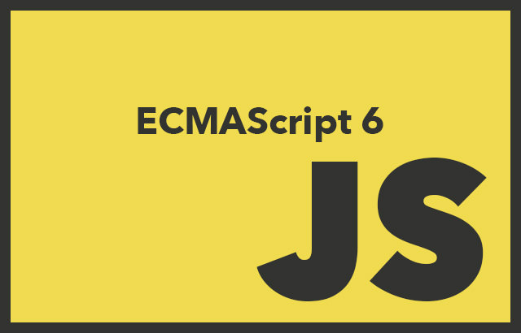

# ES6-boilerplate

ES6 boilerplate configured with npm, babel, webpack2 and eslint based on google javascript style guide. INSTALL.md contains all instructions used to forge the boilerplate project.




## Install

run `npm install` on root directory

```bash
npm install
```

## Usage

* `npm start` to run eslint on watch mode and live-server
* `npm run start:webpack-dev-server` to run eslint on watch mode and webpack-dev-server

## Other usages

* `npm run watch` to only watch for and recompile on changes.
* `npm run build` to generate a minified, production-ready build.
* `npm run lint` to only lint files
* `npm run lint:watch` to lint files on watch mode